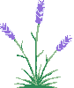
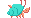
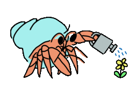
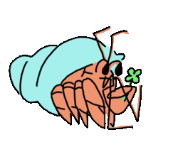
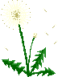
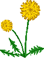

<h1 align="center" style="font-size: 4em;">
  
   
  
  
  
  
  Scuttlebutt
  
  
  
  
</h1>

<h2 align="center">
  
  a decent(ralised) secure gossip platform
  
</h2>

<h4 align="center">
  sea-slang for gossip - a scuttlebutt is basically a watercooler on a ship
</h4>

236358264

## Ready to get started?

**We have a detailed [Getting Started Guide](getting-started.md) which is
recommended if you've got a few minutes.**

If you just need to get up and running ASAP here's what you need to know:

### Quick Start

1. [Install Patchwork](http://dinosaur.is/patchwork-downloader/).
2. Boot it up and set up your profile. 
3. Go to [the list of pub servers](https://github.com/ssbc/ssb-server/wiki/Pub-Servers) and get an invite code from one.
4. Click "+ Join Pub" in the top left corner of Patchwork and paste in the invite code.
5. Explore by browsing public posts and channels, expand into your extended network (Click on More > Extended Network).
6. Introduce yourself on the #new-people channel.
7. Follow people you find interesting. You will download content authored by everyone you follow, and everyone who they follow.
8. Have fun, and be respectful of others. The scuttleverse is a nice place.

## Contributor Code of Conduct

Please note that this project is released with a [Contributor Code of Conduct](code-of-conduct.md). By participating in this project you agree to abide by its terms.

## Have Other Questions?

A great place to learn more is our [FAQ page](faq/index.md)

In addition, you'll find a wealth of resources within this handbook, accessible through the sidebar.  

The resources are organized by these topics:

* [Contributing](contributing.md)
* [Talks](talks.md)
* [Applications](applications.md)
* [Principles](principles/index.md)
* [FAQ](faq/index.md)
* [Stories](stories/index.md)
* [Protocol](protocol.md)
* [Modules](modules.md)
* [Concepts](concepts/index.md)
* [Guides](guides/index.md)
* [Glossary](glossary.md)

  
  
  
  
  
  
  
  
  

