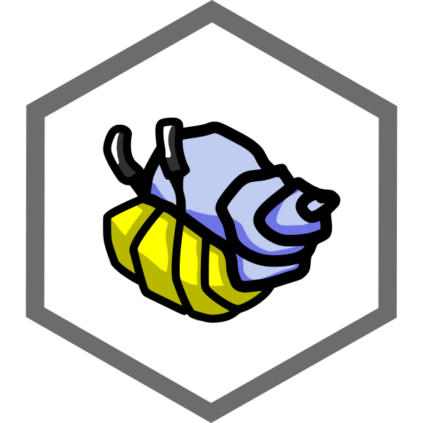

<h1 align="center">
  
  <br />
  SSB Handbook
</h1>

<h4 align="center">
  A work-in-progress guide to the ssb-verse, key concepts and influences
</h4>

## What Is Scuttlebutt?

Historically, sea-slang for gossip - a scuttlebutt is basically a watercooler on a ship.

Scuttlebutt is a decent(ralised) secure gossip platform.

> This seems like a silly name, but I assure you, this is real science. Read this: http://www.cs.cornell.edu/home/rvr/papers/flowgossip.pdf
>
> Or, if you're lazy: http://en.wikipedia.org/wiki/Scuttlebutt (laziness will get you nowhere, btw)

## How To Get Started

The easiest way to get started is using [patchwork](https://github.com/ssbc/patchwork), a classic social networking [application](./applications.md).


### Easy path

1. [Download an Installer](https://github.com/ssbc/patchwork/releases) for Windows, macOS and Linux
2. Get a [pub invite code](https://github.com/ssbc/scuttlebot/wiki/Pub-Servers)  
3. Use the pub invite : in Patchwork click `+ Join Pub` and paste the invite code

Step 2 is important if you want to be able to find people further than your local network - it sets you up with a robot friend on the internet which helps you find and communicate with people.
Read more about Pubs and their role [here](./concepts/pub.md).


### Build from Source

This is more technical than the easy path, mainly useful if you're interested in developing Patchwork.

On Linux you'll need some more dependencies. On Debian:

```shell
sudo apt-get install libxext-dev libxtst-dev libxkbfile-dev g++ m4 automake libtool
```

With [node (>= 4) and npm (>= 2) installed](https://github.com/creationix/nvm):

```shell
$ git clone https://github.com/ssbc/patchwork
$ cd patchwork
$ npm install
$ npm start
```

Follow steps `2.` and `3.` above to connect to the network.


## Join The Community

Check out the following channels by typing their name (with #) in the search bar:
- **#new-people**: introduce yourself
- **#faq**: first impressions, what is confusing as a new user?
- **#patchwork**: report bugs, suggestions, etc
- **#scuttlebutt**: protocol related discussion

Here are some other favourites:
- **#boats**: people living on, hacking, and bulding boats
- **#cooking-channel**: nerds sharing recipes
- **#solarpunk**: step into the future
- **#gardening**: get some gardening on with your off-grid
- **#anarchitecture**: decentralise all the things

## About This Handbook

To view the public handbook, browse to [scuttlebutt.nz](https://www.scuttlebutt.nz)

The handbook is organized by topics:

* [Contributing](contributing.md)
* [Talks](talks.md)
* [Applications](applications.md)
* [Principles](principles.md)
* [FAQ](faq/index.md)
* [Stories](stories/index.md)
* [Modules](modules.md)
* [Concepts](concepts/index.md)
* [Guides](guides/index.md)
* [Glossary](glossary.md)

## Other documentation

Over time we have scattered documentation around in a few places:

- [scuttlebot.io](https://scuttlebot.io)
- [ssbc.github.io](https://ssbc.github.io)

[Please help us consolidate this here](contributing.md#contributing-documentation)!

## Other Projects

Scuttlebutt is not the only dex project:

- [Matrix](http://matrix.org/)
- [Bitcoin](https://bitcoin.org/)
- [Ethereum](https://www.ethereum.org/)
- [Zerocoin](http://zerocoin.org/)
- [MaidSafe](http://maidsafe.net/)
- [IPFS](https://ipfs.io/)
- [Dat](http://datproject.org/)
- [Solid](https://github.com/solid/solid)
- [cjdns](https://github.com/cjdelisle/cjdns)
- [Syncthing](https://syncthing.net/)
- [Indie](https://ind.ie/)
- [Twister](http://twister.net.co/)
- [WebTorrent](https://webtorrent.io/)
- [StrongLink](https://github.com/btrask/stronglink)
- [RetroShare](http://retroshare.sourceforge.net)
- [ZeroNet](http://zeronet.io)
