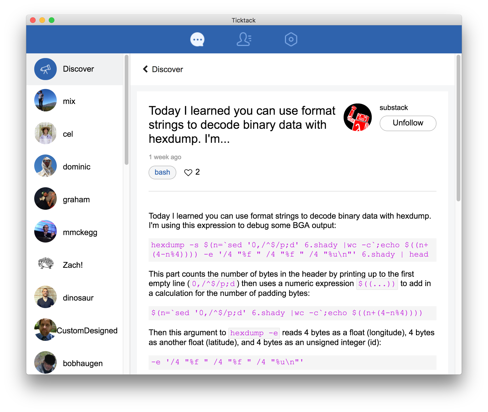

# Scuttlebutt Apps

The following is an overview of some known Scuttlebutt-based apps.

_if you are new, [start with Patchwork](./#how-to-get-started)!_

Please feel free to extend and modify this registry.

- [Patchwork](#patchwork)
- [Patchbay](#patchbay)
- [Patchfoo](#patchfoo)
- [git-ssb](#git-ssb)
- [MMMMM](#mmmmm)
- [TickTack](#ticktack)
- [patch-gatherings](#patch-gatherings)
- [ssb-chess](#ssb-chess)
- [minbase](#minbase)
- [Ferment](#ferment)
- [ssb-graphviz](#ssb-graphviz)
- [ssb-usage-stats](#ssb-usage-stats)
- [Patchwork "Classic"](#patchwork-classic)
- [easy-ssb-pub](#easy-ssb-pub)

---

## [Patchwork](https://github.com/ssbc/patchwork)

A decentralized messaging and sharing app built using [patchcore](https://github.com/ssbc/patchcore).

The goal is to make a standalone, [easy to install](./#how-to-get-started), "social" view into the SSB world.

[How to get started](./#how-to-get-started)

[Releases](https://github.com/ssbc/patchwork/releases)

Links : [git-ssb](https://git-ssb.celehner.com/%25bfG9dyXtlic9umNzgwYuG8nhjG0ycUrlBROprvyBZaU%3D.sha256) | [github](https://github.com/ssbc/patchwork)

SSB : ssb://%bfG9dyXtlic9umNzgwYuG8nhjG0ycUrlBROprvyBZaU=.sha256

---

## [Patchbay](https://github.com/ssbc/patchbay)

Also built on [patchcore](https://github.com/ssbc/patchcore), but uses a tabbed interface instead and has some more bleeding edge features.

The goal is to make a client developers love - it comes with social views, as well as git interface into the scuttleverse.

Links : [git-ssb](https://git-ssb.celehner.com/%25s9mSFATE4RGyJx9wgH22lBrvD4CgUQW4yeguSWWjtqc%3D.sha256) | [github](https://github.com/ssbc/patchbay)

SSB : ssb://%s9mSFATE4RGyJx9wgH22lBrvD4CgUQW4yeguSWWjtqc=.sha256 

---

## [Patchfoo](http://git.scuttlebot.io/%25YAg1hicat%2B2GELjE2QJzDwlAWcx0ML%2B1sXEdsWwvdt8%3D.sha256)

Plain SSB web UI. Uses HTML forms instead of client-side JS. Designed for use on low-power and low-resource computers.

[How to get started](https://github.com/noffle/sailing-patchfoo)

Links : [git-ssb](http://git.scuttlebot.io/%25YAg1hicat%2B2GELjE2QJzDwlAWcx0ML%2B1sXEdsWwvdt8%3D.sha256) | [github](https://github.com/ssbc/patchfoo)

SSB : ssb://%YAg1hicat+2GELjE2QJzDwlAWcx0ML+1sXEdsWwvdt8=.sha256

---

## git-ssb

A totally decent git interface.

News about projects of friends, or people you follow.

Familiar interface for raising issues, forking, opening pull requests.

Known online portals serving git-ssb over http: 

 - https://gitmx.com
 - https://git-ssb.celehner.com
 - http://git.mixmix.io

[How to get started](https://github.com/noffle/git-ssb-intro)

Links : [git-ssb](https://git-ssb.celehner.com/%25n92DiQh7ietE%2BR%2BX%2FI403LQoyf2DtR3WQfCkDKlheQU%3D.sha256) | [github](https://github.com/clehner/git-ssb)

SSB : ssb://%n92DiQh7ietE+R+X/I403LQoyf2DtR3WQfCkDKlheQU=.sha256 

---

## [MMMMM](https://github.com/staltz/mmmmm-mobile)

[Releases](https://github.com/staltz/mmmmm-mobile/releases)

Links : [github](https://github.com/staltz/mmmmm-mobile)

---

## Ticktack

[Releases](https://github.com/ticktackim/ticktack-network/releases)

Links : [git-ssb](https://git.scuttlebot.io/%25wnNDjViKYZH%2BRWpbNzDXR2oxLWmTagvvFBjy97Zko4I%3D.sha256)

SSB : ssb://%wnNDjViKYZH+RWpbNzDXR2oxLWmTagvvFBjy97Zko4I=.sha256

---

## [patch-gatherings](https://github.com/pietgeursen/patch-gatherings)

A [patchcore](https://github.com/ssbc/patchcore) plugin for arranging gatherings on secure scuttlebutt

Links : [github](https://github.com/pietgeursen/patch-gatherings)

---

## [ssb-chess](https://github.com/Happy0/ssb-chess)

Correspondence chess built on top of the scuttlebutt platform.

Links : [github](https://github.com/Happy0/ssb-chess)

---

## [minbase](https://github.com/evbogue/minbase)

Minbase is an unopinionated minimal base on which to build opinionated Secure Scuttlebutt clients.

Links : [git-ssb](https://git.scuttlebot.io/%25%2BtyUthD1L689osLUj8LNLV4smRKpO7Wu07DB%2BLMd7TQ%3D.sha256) | [github](https://github.com/evbogue/minbase)

SSB : ssb://%+tyUthD1L689osLUj8LNLV4smRKpO7Wu07DB+LMd7TQ=.sha256

---

## Ferment

A music sharing app for musicians, remixers, creatores, Built using ssb + webtorrent

Tour : [youtube](https://www.youtube.com/watch?v=xgvxXbWYmrI)

Links : [git-ssb](https://git-ssb.celehner.com/%25t3XQv5Gk%2FdzJQM1fWFnMlaTlTvmtd3BHYCTIzhT%2F7G8%3D.sha256) | [github](https://github.com/fermentation/ferment)

SSB : ssb://%t3XQv5Gk/dzJQM1fWFnMlaTlTvmtd3BHYCTIzhT/7G8=.sha256

---

## ssb-graphviz

An interactive visualisation of your local scuttleverse.

Fly with [w,a,s,d] and look with [up,left,down,right].

Hover over nodes to see who they are and light up their 1st and (dimmer) 2nd degree friendships.

SSB : ssb://%hNm67sfnZFtWkD/+1qxH3UfzhXykfpKtOL1C/XbLANA=.sha256

---

## [ssb-usage-stats](https://celehner.com/ssbc/stats/daily.html)

Posts published over time (from the perspective of Cel's pub server). Colors represent when that user first posted (so is a way of visualising cohorts).

Links : [github](https://github.com/ssbc/ssb-usage-stats)

---

## Patchwork "Classic"

The first major messaging interface built on SSB, using React. Currently has installers for Mac and Linux, and translations.

Tour (old version) : [youtube](https://www.youtube.com/watch?v=vmQUfZMCVJ0)

Links : [github](https://github.com/ssbc/patchwork-classic-electron)

---

## easy-ssb-pub 

 

https://github.com/staltz/easy-ssb-pub

---

