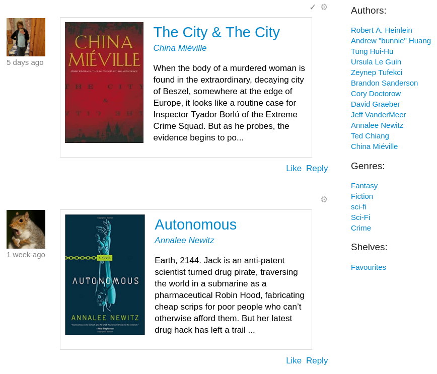

# Scuttlebutt Apps

Your scuttlebutt is the data you carry with you - imagine a little slice of a parallel universe in your pocket.
This data is yours and you can interact with it however you like. 

These apps are different kinds of **magic glasses** to help you interact with this reality.
Try different glasses on, change them when you're bored, make some new ones that fit you better ... your scuttleverse doesn't mind - it's just data.

Come explore with us!
_If you are new, you might like to [start with Patchwork](./#how-to-get-started)!_

<table> 
  <tr>
    <th>Social views</td>
    <th>Coordination views</td>
    <th>Data viz / tools</td>
  </tr>
  <tr>
    <td> 
      Direct posting / conversation:
      <ul>
        <li><a href='#patchwork'>Patchwork</a></li>
        <li><a href='#patchbay'>Patchbay</a></li>
        <li><a href='#patchfoo'>Patchfoo</a></li>
        <li><a href='#minbase'>Minbase</a></li>
        <li><a href='#mmmmm'>MMMMM</a></li>
        <li><a href='#patchwork-classic'>Patchwork Classic</a></li>
      </ul>

      Other:
      <ul>
        <li><a href='#ssb-chess'>ssb-chess</a></li>
        <li><a href='#patch-book'>patch-book</a></li>
        <li><a href='#ticktack'>Ticktack</a> (blogging)</li>
        <li><a href='#ferment'>Ferment</a> (music)</li>
      </ul>
    </td>
    <td> 
      <ul>
        <li>ssb-loomio (coming soon)</li>
        <li><a href='#patch-gatherings'>patch-gatherings</a></li>
        <li><a href='#git-ssb'>git-ssb</a></li>
      </ul>
    </td>
    <td> 
      <ul>
        <li><a href='#ssb-usage-stats'>ssb-usage-stats</a></li>
        <li><a href='#ssb-graphviz'>ssb-graphviz</a></li>
        <li><a href='#easy-ssb-pub'>easy-ssb-pub</a></li>
      </ul>
    </td>
  </tr>
</table>

## [Patchwork](https://github.com/ssbc/patchwork)

A decentralized messaging and sharing app built using [patchcore](https://github.com/ssbc/patchcore). The goal is to make a standalone, [easy to install](./#how-to-get-started), "social" view into the SSB world.

[**How to get started**](./#how-to-get-started) (must read) | [Installers](https://github.com/ssbc/patchwork/releases)

Source code: [git-ssb](https://git-ssb.celehner.com/%25bfG9dyXtlic9umNzgwYuG8nhjG0ycUrlBROprvyBZaU%3D.sha256) | [github](https://github.com/ssbc/patchwork) | `ssb://%bfG9dyXtlic9umNzgwYuG8nhjG0ycUrlBROprvyBZaU=.sha256`

---

## [Patchbay](https://github.com/ssbc/patchbay)

Also built on [patchcore](https://github.com/ssbc/patchcore), but uses a tabbed interface instead and has some more bleeding edge features. The goal is to make a client developers love - it comes with social views, as well as chess, book reviews, and some git interface.

Installers _(coming soon)_

Source code : [git-ssb](https://git-ssb.celehner.com/%25s9mSFATE4RGyJx9wgH22lBrvD4CgUQW4yeguSWWjtqc%3D.sha256) | [github](https://github.com/ssbc/patchbay) | `ssb://%s9mSFATE4RGyJx9wgH22lBrvD4CgUQW4yeguSWWjtqc=.sha256`

---

## [Patchfoo](http://git.scuttlebot.io/%25YAg1hicat%2B2GELjE2QJzDwlAWcx0ML%2B1sXEdsWwvdt8%3D.sha256)

Plain SSB web UI. Uses HTML forms instead of client-side JS. Designed for use on low-power and low-resource computers.

[**How to get started**](https://github.com/noffle/sailing-patchfoo)

Source code : [git-ssb](http://git.scuttlebot.io/%25YAg1hicat%2B2GELjE2QJzDwlAWcx0ML%2B1sXEdsWwvdt8%3D.sha256) | [github](https://github.com/ssbc/patchfoo) | `ssb://%YAg1hicat+2GELjE2QJzDwlAWcx0ML+1sXEdsWwvdt8=.sha256`

---

## [minbase](https://github.com/evbogue/minbase)

Minbase is an unopinionated minimal base on which to build opinionated Secure Scuttlebutt clients.

Source code : [git-ssb](https://git.scuttlebot.io/%25%2BtyUthD1L689osLUj8LNLV4smRKpO7Wu07DB%2BLMd7TQ%3D.sha256) | [github](https://github.com/evbogue/minbase) | `ssb://%+tyUthD1L689osLUj8LNLV4smRKpO7Wu07DB+LMd7TQ=.sha256`

---

## [MMMMM](https://github.com/staltz/mmmmm-mobile)

A _very_ early mobile version of scuttlebutt for android.

[**Installers**](https://github.com/staltz/mmmmm-mobile/releases)

Source code : [github](https://github.com/staltz/mmmmm-mobile)

---

## Patchwork "Classic"

The first major messaging interface built on SSB, using React. Currently has installers for Mac and Linux, and translations.

Tour (old version) : [youtube](https://www.youtube.com/watch?v=vmQUfZMCVJ0)

Source code : [github](https://github.com/ssbc/patchwork-classic-electron)

---

## [ssb-chess](https://github.com/Happy0/ssb-chess)

Correspondence chess built on top of the scuttlebutt platform.

Source code : [github](https://github.com/Happy0/ssb-chess)

---

## patch-book

Review and discuss books overs scuttlebutt. Patch-book is a [patchcore](https://github.com/ssbc/patchcore) based plugin. You can use it in e.g. Patchbay.

Source code: `ssb://%zoL1riX2mELF0j3dydWtQ+go4nI4jaByvm5Z02cRyaQ=.sha256`

---

## Ticktack

A blog publishing app for long-form articles. Also has private messaging integrated.

[**Installers**](https://github.com/ticktackim/ticktack-workplan/releases) (auto connects you to some blogging parts of the archipelago)

Source code : [git-ssb](https://git.scuttlebot.io/%25wnNDjViKYZH%2BRWpbNzDXR2oxLWmTagvvFBjy97Zko4I%3D.sha256) | `ssb://%wnNDjViKYZH+RWpbNzDXR2oxLWmTagvvFBjy97Zko4I=.sha256`

---

## Ferment

A music sharing app for musicians, remixers, creatores, Built using ssb + webtorrent.
Note: Servers for the webtorrent part of this are currently not being maintained.

Tour : [youtube](https://www.youtube.com/watch?v=xgvxXbWYmrI)

Source code : [git-ssb](https://git-ssb.celehner.com/%25t3XQv5Gk%2FdzJQM1fWFnMlaTlTvmtd3BHYCTIzhT%2F7G8%3D.sha256) | [github](https://github.com/fermentation/ferment) | `ssb://%t3XQv5Gk/dzJQM1fWFnMlaTlTvmtd3BHYCTIzhT/7G8=.sha256`

---

## git-ssb

A totally decent git interface. Familiar interface for raising issues, forking, opening pull requests.
News about projects of friends, or people you follow.

[**How to get started**](https://github.com/noffle/git-ssb-intro)

Known online portals serving git-ssb over http: 
 - https://gitmx.com
 - https://git-ssb.celehner.com
 - ~~http://git.mixmix.io~~ (currently down)

Source code : [git-ssb](https://git-ssb.celehner.com/%25n92DiQh7ietE%2BR%2BX%2FI403LQoyf2DtR3WQfCkDKlheQU%3D.sha256) | [github](https://github.com/clehner/git-ssb) | `ssb://%n92DiQh7ietE+R+X/I403LQoyf2DtR3WQfCkDKlheQU=.sha256`

---

## [patch-gatherings](https://github.com/pietgeursen/patch-gatherings)

Organise meetups / events over scuttlebutt. Gatherings is a [patchcore](https://github.com/ssbc/patchcore) based plugin. You can use it in e.g. Patchwork, Patchbay.

Source code : [github](https://github.com/pietgeursen/patch-gatherings)

---

## ssb-graphviz

An interactive visualisation of your local scuttleverse. Fly with [w,a,s,d] and look with [up,left,down,right]. Hover over nodes to see who they are and light up their 1st and (dimmer) 2nd degree friendships.

Source code : `ssb://%hNm67sfnZFtWkD/+1qxH3UfzhXykfpKtOL1C/XbLANA=.sha256`

---

## [ssb-usage-stats](https://celehner.com/ssbc/stats/daily.html)

Posts published over time (from the perspective of Cel's pub server). Colors represent when that user first posted (so is a way of visualising cohorts).

See it live : https://celehner.com/ssbc/stats/daily.html
Source code : [github](https://github.com/ssbc/ssb-usage-stats)

---

## easy-ssb-pub 

 

https://github.com/staltz/easy-ssb-pub

