# Scuttlebutt Apps

Your scuttlebutt is the data you carry with you - imagine a little slice of a parallel universe in your pocket.
This data is yours and you can interact with it however you like. 

These apps are different kinds of **magic glasses** to help you interact with this reality.
Try different glasses on, change them when you're bored, make some new ones that fit you better ... your scuttleverse doesn't mind - it's just data.

Come explore with us!
_If you are new, you might like to [start with Patchwork](./#how-to-get-started)!_

<table> 
  <tr>
    <th>Discussion Apps</th>
    <th>Other Apps</th>
    <th>Tools & Data Viz</th>
  </tr>
  <tr>
    <td>
      <ul>
        <li><a href='#patchwork'>Patchwork</a></li>
        <li><a href='#patchbay'>Patchbay</a></li>
        <li><a href='#patchfoo'>Patchfoo</a></li>
        <li><a href='#mmmmm'>MMMMM</a></li>
        <li><a href='#patchfox'>Patchfox</a></li>
        <li><a href='#patchless'>Patchless</a></li>
        <li><a href='#ngx-ssb-client'>ngx-ssb-client</a></li>
        <li><a href='#mvd'>mvd</a></li>
        <li><a href='#patchwork-classic'>Patchwork Classic</a></li>
      </ul>
    </td>
    <td> 
      <ul>
        <li><a href='#git-ssb'>git-ssb</a> (code projects)</li>
        <li><a href='#ssb-npm'>ssb-npm</a> (code packages)</li>
        <li><a href='#scat'>scat</a> (chat)</li>
        <li><a href='#ticktack'>Ticktack</a> (blogging)</li>
        <li><a href='#talenet'>tale:net</a> (skills)</li>
        <li><a href='#ssb-chess'>ssb-chess</a></li>
        <li><a href='#patch-book'>patch-book</a></li>
        <li><a href='#recipes'>recipes</a></li>
        <li><a href='#ssbdrv'>ssbdrv</a> (files)</li>
        <li><a href='#ferment'>Ferment</a> (music)</li>
      </ul>
    </td>
    <td> 
      <ul>
        <li><a href='#ssb-pub'>ssb-pub</a></li>
        <li><a href='#easy-ssb-pub'>easy-ssb-pub</a></li>
        <li><a href='#twitter-ssb-import'>twitter-ssb-import</a></li>
        <li><a href='#ssb-web'>ssb-web</a></li>
        <li><a href='#ssb-to-graphml'>ssb-to-graphml</a></li>
        <li><a href='#ssb-usage-stats'>ssb-usage-stats</a></li>
        <li><a href='#ssb-graphviz'>ssb-graphviz</a></li>
      </ul>
    </td>
  </tr>
</table>

## [Patchwork](https://github.com/ssbc/patchwork)

A decentralized messaging and sharing app built using [patchcore](https://github.com/ssbc/patchcore). The goal is to make a standalone, [easy to install](./#how-to-get-started), "social" view into the SSB world.

[**How to get started**](./#how-to-get-started) (must read) | [Installers](https://github.com/ssbc/patchwork/releases)

Source code : [git-ssb](https://git-ssb.celehner.com/%25bfG9dyXtlic9umNzgwYuG8nhjG0ycUrlBROprvyBZaU%3D.sha256) | [GitHub](https://github.com/ssbc/patchwork) | `ssb://%bfG9dyXtlic9umNzgwYuG8nhjG0ycUrlBROprvyBZaU=.sha256`

---

## [Patchbay](https://github.com/ssbc/patchbay)

Also built on [patchcore](https://github.com/ssbc/patchcore), but uses a tabbed interface instead and has some more bleeding edge features. The goal is to make a client developers love - it comes with social views, as well as chess, book reviews, and some git interface.

[Installers](https://github.com/ssbc/patchbay/releases)

Source code : [git-ssb](https://git-ssb.celehner.com/%25s9mSFATE4RGyJx9wgH22lBrvD4CgUQW4yeguSWWjtqc%3D.sha256) | [GitHub](https://github.com/ssbc/patchbay) | `ssb://%s9mSFATE4RGyJx9wgH22lBrvD4CgUQW4yeguSWWjtqc=.sha256`

---

## [Patchfoo](http://git.scuttlebot.io/%25YAg1hicat%2B2GELjE2QJzDwlAWcx0ML%2B1sXEdsWwvdt8%3D.sha256)

Plain SSB web UI. Uses HTML forms instead of client-side JS. Designed for use on low-power and low-resource computers.

[**How to get started**](https://github.com/noffle/sailing-patchfoo)

Source code : [git-ssb](http://git.scuttlebot.io/%25YAg1hicat%2B2GELjE2QJzDwlAWcx0ML%2B1sXEdsWwvdt8%3D.sha256) | [GitHub](https://github.com/ssbc/patchfoo) | `ssb://%YAg1hicat+2GELjE2QJzDwlAWcx0ML+1sXEdsWwvdt8=.sha256`

---

## [MMMMM](https://github.com/staltz/mmmmm-mobile)

A _very_ early mobile version of scuttlebutt for android.

[**Installers**](https://github.com/staltz/mmmmm-mobile/releases)

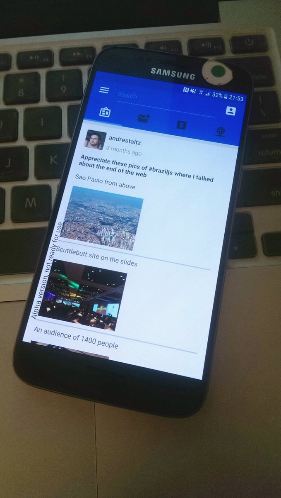

Source code : [GitHub](https://github.com/staltz/mmmmm-mobile)

---

## [Patchfox](https://github.com/soapdog/patchfox)

> A client for scuttlebutt network as a Firefox WebExtension

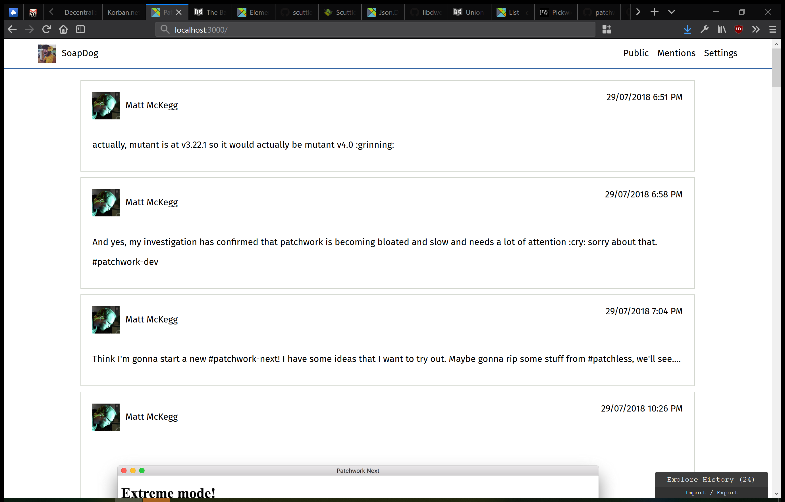

Source code : [GitHub](https://github.com/soapdog/patchfox)

---

## [Patchless](https://github.com/patchless/patchless)

> patchless is a standard for modular ui apps.

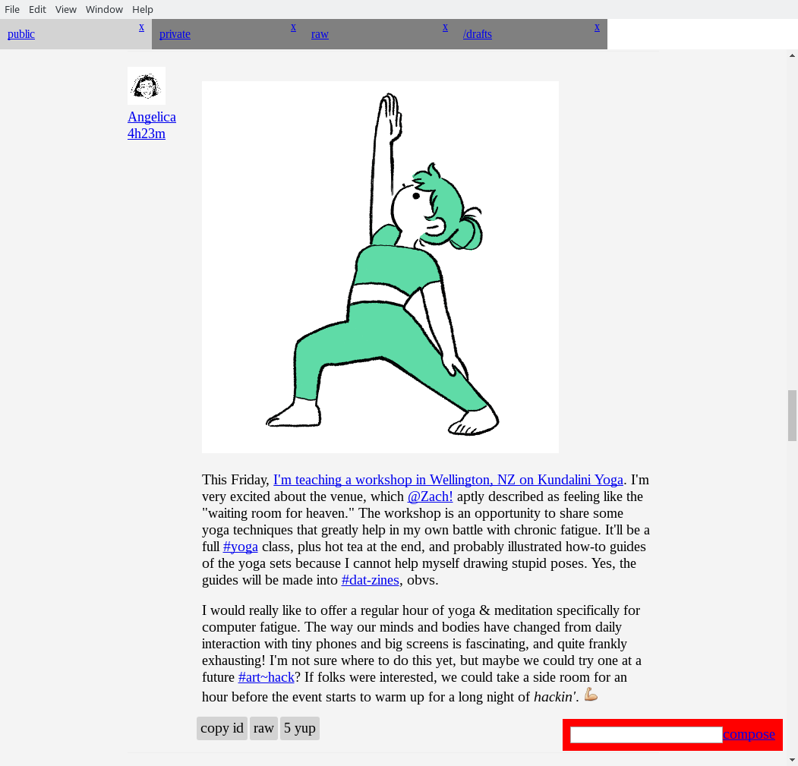

Source code : [GitHub](https://github.com/patchless/patchless)

---

## [ngx-ssb-client](https://github.com/datenknoten/ngx-ssb-client)

> secure scuttlebutt client using „modern“ web development technologies.

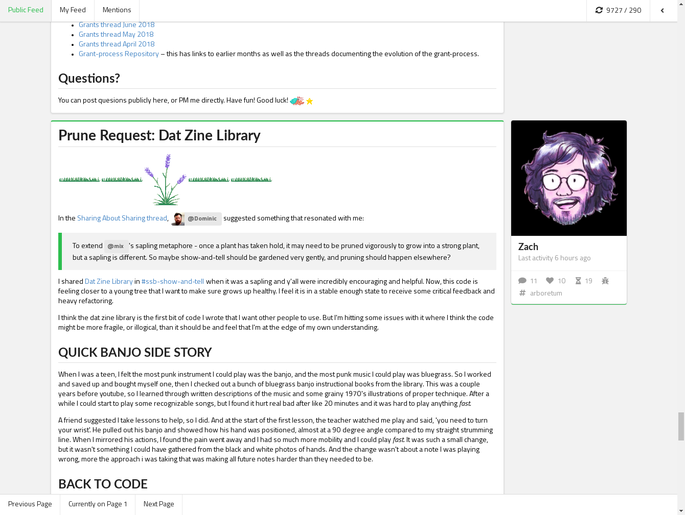

Source code : [GitHub](https://github.com/datenknoten/ngx-ssb-client)

---

## [mvd](http://gitmx.com/)

> This is a minimum viable full-stack Decent server and client.

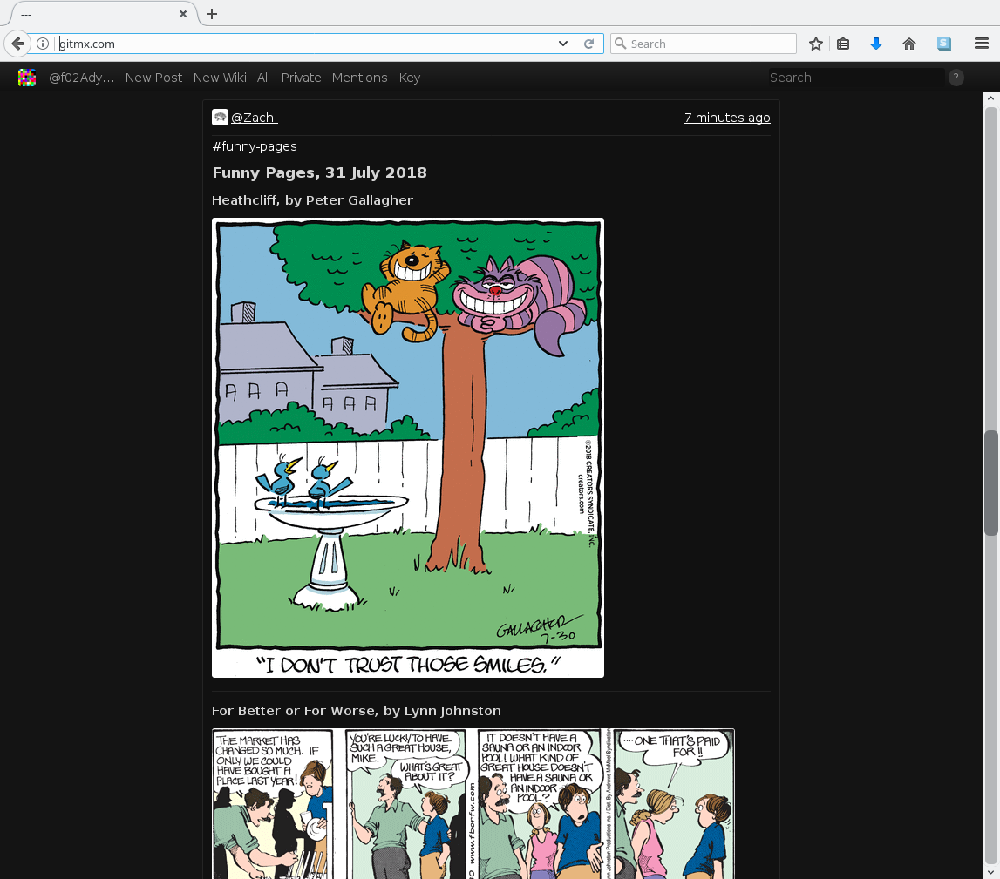

Source code: [GitHub](https://github.com/evbogue/mvd) | [git-ssb](http://git-ssb.celehner.com/%25NPNNvcnTMZUFZSWl%2F2Z4XX%2BYSdqsqOhyPacp%2BlgpQUw%3D.sha256) | `ssb://%NPNNvcnTMZUFZSWl/2Z4XX+YSdqsqOhyPacp+lgpQUw=.sha256`

---

## Patchwork "Classic"

The first major messaging interface built on SSB, using React. Currently has installers for Mac and Linux, and translations.

Tour (old version) : [youtube](https://www.youtube.com/watch?v=vmQUfZMCVJ0)

Source code : [GitHub](https://github.com/ssbc/patchwork-classic-electron)

---

## git-ssb

A totally decent git interface using ssb. Familiar interface for raising issues, forking, opening pull requests. News about projects of friends, or people you follow.

[**How to get started**](https://github.com/noffle/git-ssb-intro)

Known online portals serving `git-ssb` over the Web:

 - https://git.scuttlebot.io/
 - https://git-ssb.celehner.com

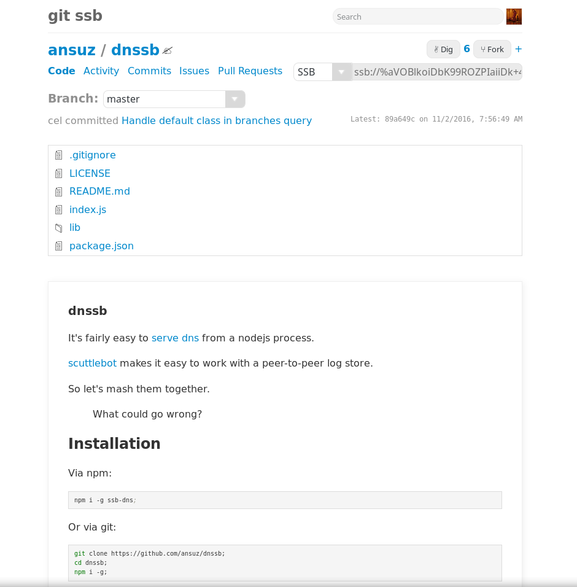

Source code : [git-ssb](https://git-ssb.celehner.com/%25n92DiQh7ietE%2BR%2BX%2FI403LQoyf2DtR3WQfCkDKlheQU%3D.sha256) | [GitHub](https://github.com/clehner/git-ssb) | `ssb://%n92DiQh7ietE+R+X/I403LQoyf2DtR3WQfCkDKlheQU=.sha256`

---

## ssb-npm

A totally decent npm interface, using ssb as your npm registry.

[**How to get started**](https://github.com/noffle/ssb-npm-101)

Source code : [git-ssb](https://git.scuttlebot.io/%25iqhz%2FsQCZCSp91JYAqfQPzHuDYrjw1geKPf1wJ1CvlA%3D.sha256) | `ssb://%iqhz/sQCZCSp91JYAqfQPzHuDYrjw1geKPf1wJ1CvlA=.sha256`

---

## [scat](https://github.com/stripedpajamas/scat)

tiny chat-like cli built on scuttlebutt :mouse:

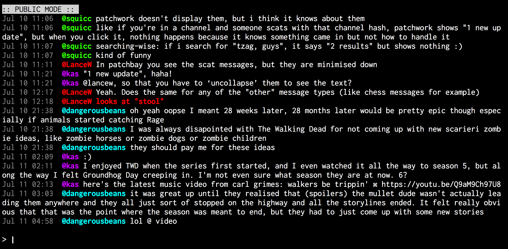

Source code : [GitHub](https://github.com/stripedpajamas/scat)

---

## Ticktack

A blog publishing app for long-form articles. Also has private messaging integrated.

[**Installers**](https://github.com/ticktackim/ticktack-workplan/releases) (auto connects you to some blogging parts of the archipelago)

Source code : [git-ssb](https://git.scuttlebot.io/%25wnNDjViKYZH%2BRWpbNzDXR2oxLWmTagvvFBjy97Zko4I%3D.sha256) | [GitHub](https://github.com/ticktackim/ticktack-workplan/releases) | `ssb://%wnNDjViKYZH+RWpbNzDXR2oxLWmTagvvFBjy97Zko4I=.sha256`

---

## [tale:net](https://t4l3.net/)

Skill sharing and ideation app

[**Installers**](https://t4l3.net/download/)

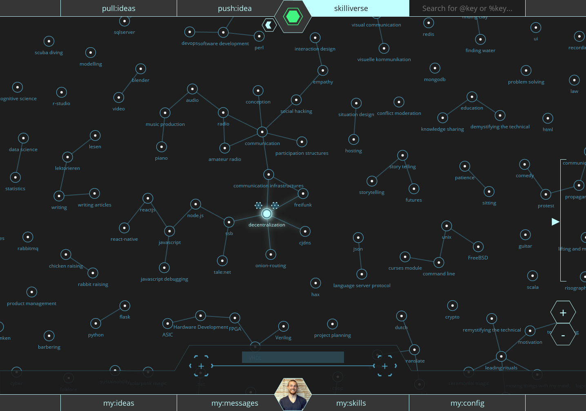

Source code : [GitHub](https://github.com/talenet/talenet)

---

## [ssb-chess](https://github.com/Happy0/ssb-chess)

Correspondence chess built on top of the scuttlebutt platform.

Source code : [GitHub](https://github.com/Happy0/ssb-chess)

---

## patch-book

Review and discuss books overs scuttlebutt. Patch-book is a [patchcore](https://github.com/ssbc/patchcore) based plugin. You can use it in e.g. Patchbay.

Source code: `ssb://%zoL1riX2mELF0j3dydWtQ+go4nI4jaByvm5Z02cRyaQ=.sha256`

---

## recipes

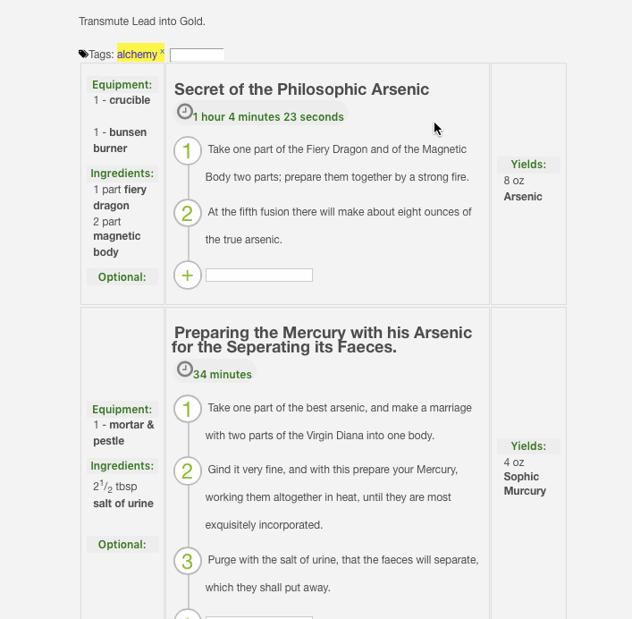

([%6ZmujAEWSxaNo5olG+gPoUq/pLrD5iPBdvoBuy8AHPg=.sha256](https://viewer.scuttlebot.io/%256ZmujAEWSxaNo5olG%2BgPoUq%2FpLrD5iPBdvoBuy8AHPg%3D.sha256))

---

## [ssbdrv](https://github.com/cn-uofbasel/ssbdrv/)

> This is a proof of concept for a decentralized file system for Secure Scuttlebutt.

> With _SSB Drive_ you can create as many file systems ("drives") as you like, share and organize files with your friends without requiring a central repository or server. When you work on your files while offline, the _SSB Drive_ file system will merge automatically with the rest of the world once you rejoin the grid. Name conflicts are handled with "Observed Removed Sets" (OR-Sets) from CRDT.

Source code : [GitHub](https://github.com/cn-uofbasel/ssbdrv/)

---

## Ferment

A music sharing app for musicians, remixers, creatores, Built using ssb + webtorrent.
Note: Servers for the webtorrent part of this are currently not being maintained.

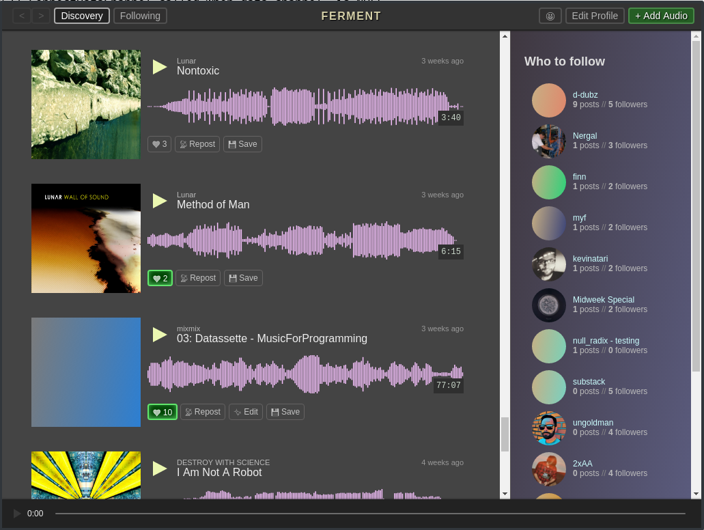

Tour : [youtube](https://www.youtube.com/watch?v=xgvxXbWYmrI)

Source code : [git-ssb](https://git-ssb.celehner.com/%25t3XQv5Gk%2FdzJQM1fWFnMlaTlTvmtd3BHYCTIzhT%2F7G8%3D.sha256) | [GitHub](https://github.com/fermentation/ferment) | `ssb://%t3XQv5Gk/dzJQM1fWFnMlaTlTvmtd3BHYCTIzhT/7G8=.sha256`

---

## ssb-pub 

https://github.com/ahdinosaur/ssb-pub

---

## easy-ssb-pub 

 

https://github.com/staltz/easy-ssb-pub

---

## twitter-ssb-import

> Script to import tweets from Twitter to ssb, so that they will display in Patchwork.

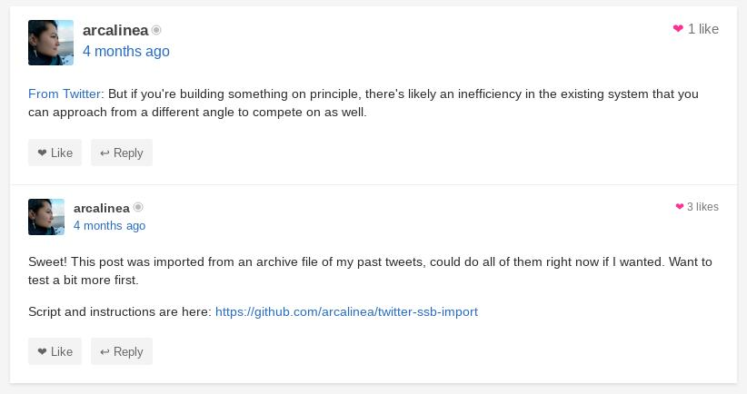

Source code : [GitHub](https://github.com/arcalinea/twitter-ssb-import)

---

## ssb-web

%dBn9uyqFKuinu4wv4sEYY3Cp49kJswkrTMka7wJJXTM=.sha256

### [ssb-webify](https://github.com/noffle/ssb-webify)

> Convert a local file hierarchy into a scuttlebutt website

Source code : [GitHub](https://github.com/noffle/ssb-webify)

### [ssb-web-resolver](https://github.com/noffle/ssb-web-resolver)

> Resolve an ssb-web url

Source code : [GitHub](https://github.com/noffle/ssb-web-resolver)

---

## [ssb-to-graphml](https://www.npmjs.com/package/ssb-to-graphml)

Convert your SSB social graph to GraphML format.

<a href="https://twitter.com/andrestaltz/status/1011980406919434240">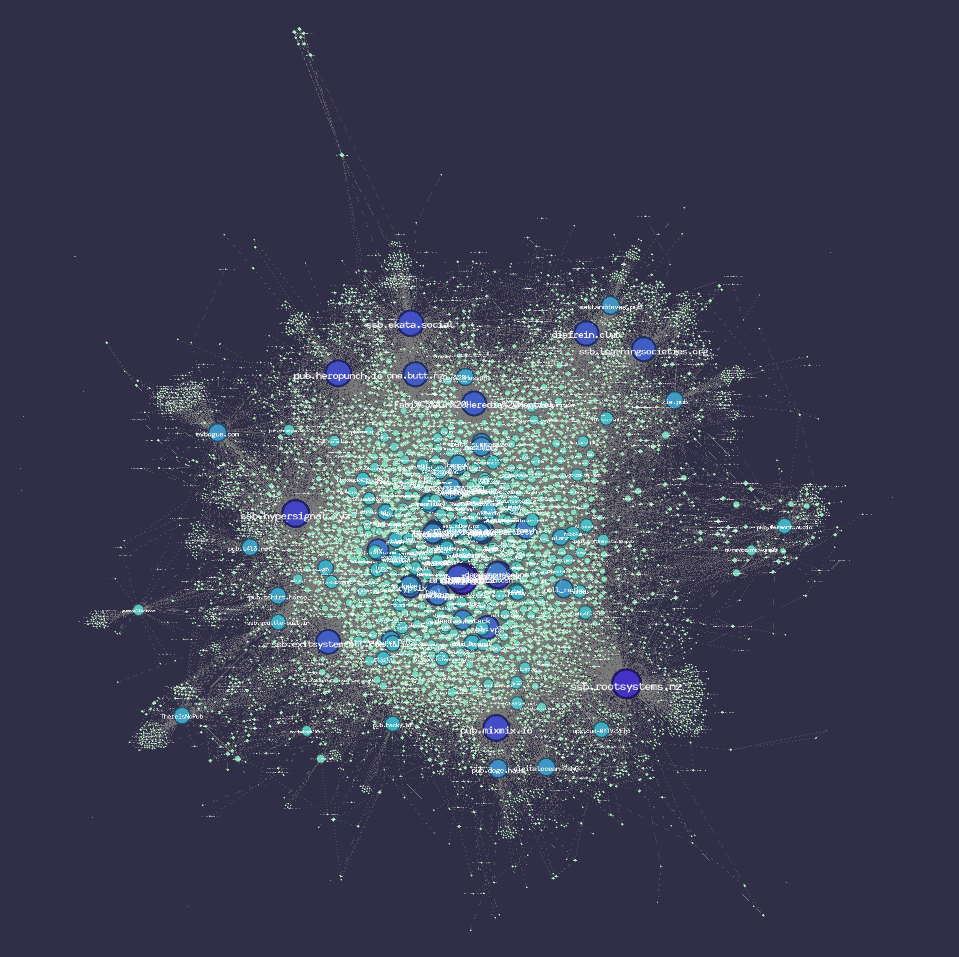</a>

<a href="https://twitter.com/whimful/status/1012123357389570048">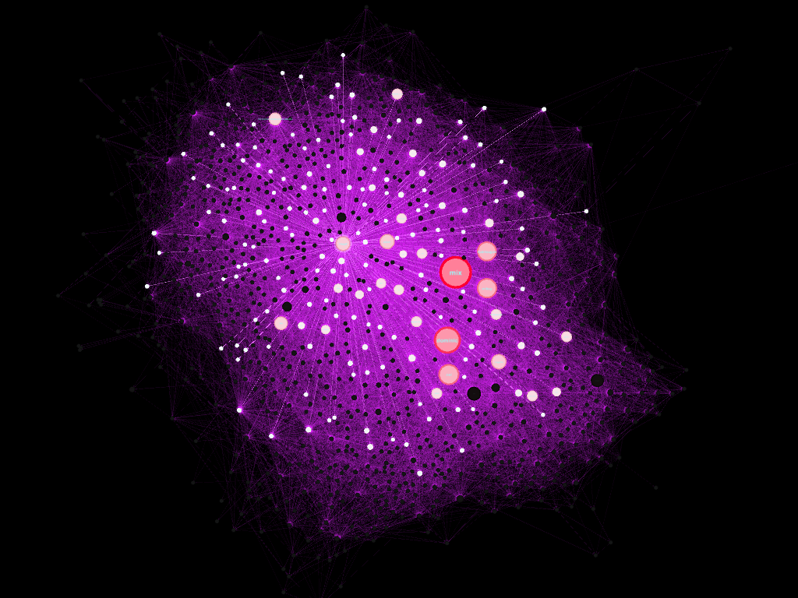</a>

Source code : [GitLab](https://gitlab.com/staltz/ssb-to-graphml)

---

## ssb-graphviz

An interactive visualisation of your local scuttleverse. Fly with [w,a,s,d] and look with [up,left,down,right]. Hover over nodes to see who they are and light up their 1st and (dimmer) 2nd degree friendships.

Source code : [GitHub](https://github.com/ssbc/ssb-graphviz) | `ssb://%hNm67sfnZFtWkD/+1qxH3UfzhXykfpKtOL1C/XbLANA=.sha256`

---

## [ssb-usage-stats](https://celehner.com/ssbc/stats/daily.html)

Posts published over time (from the perspective of Cel's pub server). Colors represent when that user first posted (so is a way of visualising cohorts).

See it live : https://celehner.com/ssbc/stats/daily.html

Source code : [GitHub](https://github.com/ssbc/ssb-usage-stats)
