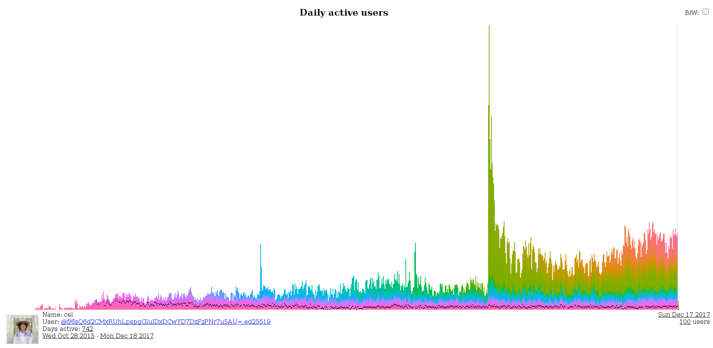

# Scuttlebutt Apps

The following is an overview of the known Secure Scuttlebutt-based apps.
Please feel free to extend and modify this registry.

---

## Patchwork

A remake of [Patchwork Classic](https://github.com/ssbc/patchwork-classic) using [patchcore](https://github.com/ssbc/patchcore) and UX/ideas from [ferment](https://github.com/mmckegg/ferment).

The goal is to make a standalone, easy to install, "social" view into the ssb world.

Links : [git-ssb](https://git-ssb.celehner.com/%25bfG9dyXtlic9umNzgwYuG8nhjG0ycUrlBROprvyBZaU%3D.sha256) | [github](https://github.com/ssbc/patchwork)

SSB : ssb://%bfG9dyXtlic9umNzgwYuG8nhjG0ycUrlBROprvyBZaU=.sha256

---

## Patchbay

Also built on [patchcore](https://github.com/ssbc/patchcore), but uses a tabbed interface instead and has some more bleeding edge features.

The goal is to make a client developers love - it comes with social views, as well as git interface into the scuttleverse.

Links : [git-ssb](https://git-ssb.celehner.com/%25s9mSFATE4RGyJx9wgH22lBrvD4CgUQW4yeguSWWjtqc%3D.sha256) | [github](https://github.com/ssbc/patchbay)

SSB : ssb://%s9mSFATE4RGyJx9wgH22lBrvD4CgUQW4yeguSWWjtqc=.sha256 

--- 

## Ferment

A music sharing app for musicians, remixers, creatores, Built using ssb + webtorrent

Tour : [youtube](https://www.youtube.com/watch?v=xgvxXbWYmrI)

Links : [git-ssb](https://git-ssb.celehner.com/%25t3XQv5Gk%2FdzJQM1fWFnMlaTlTvmtd3BHYCTIzhT%2F7G8%3D.sha256) | [github](https://github.com/mmckegg/ferment)

SSB : ssb://%t3XQv5Gk/dzJQM1fWFnMlaTlTvmtd3BHYCTIzhT/7G8=.sha256

---

## Git-ssb

A totally decent git interface.

News about projects of friends, or people you follow.

Familiar interface for raising issues, forking, opening pull requests.

Known online portals serving git-ssb over http: 
 - https://gitmx.com
 - https://git-ssb.celehner.com
 - http://git.mixmix.io

Links : [git-ssb](https://git-ssb.celehner.com/%25n92DiQh7ietE%2BR%2BX%2FI403LQoyf2DtR3WQfCkDKlheQU%3D.sha256) | [github](https://github.com/clehner/git-ssb)

SSB : ssb://%n92DiQh7ietE+R+X/I403LQoyf2DtR3WQfCkDKlheQU=.sha256 

---

## ssb-graphviz

An interactive visualisation of your local scuttleverse.
Fly with [w,a,s,d] and look with [up,left,down,right].
Hover over nodes to see who they are and light up their 1st and (dimmer) 2nd degree friendships.

SSB : ssb://%hNm67sfnZFtWkD/+1qxH3UfzhXykfpKtOL1C/XbLANA=.sha256

---

## SSB stats

Posts published over time (from the perspective of Cel's pub server). Colors represent when that user first posted (so is a way of visualising cohorts).

Links : [celehner](https://celehner.com/ssbc/stats/daily.html)

---

## Patchwork-Classic

The first major messaging interface built on SSB, using React. Currently has installers for Mac and Linux, and translations.

Tour (old version) : [youtube](https://www.youtube.com/watch?v=vmQUfZMCVJ0)

Links : [github](https://github.com/ssbc/patchwork-classic-electron)

---

## easy-ssb-pub 

 

https://github.com/staltz/easy-ssb-pub

