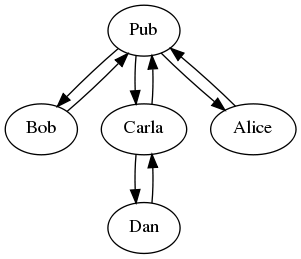
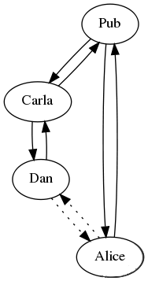

# Gossip

In Scuttlebutt, 3rd parties can relay (gossip) information for you, which improves availability.

Every message is signed, so gossipers cannot interfer with the message - note this is significantly different than real world gossip! _secure_ gossip if you will.

## Following 

Users choose which [feeds](./feed.html) to synchronize by following them.

Presently, Scuttlebot's replicate plugin, which is enabled by default, looks on the master user's feed for `type: contact` messages to know which users are currently followed.

## Replication

Since feeds are append-only, gossip is simple: request all messages in the feed that are newer than the latest message you know about. Scuttlebot maintains a table of known peers, which it cycles through, asking for updates for all followed feeds.

Since the messages are always signed, information can be distributed in any way, such as through a [sneakernet](https://en.wikipedia.org/wiki/Sneakernet). For example, you could put the latest gossip on an SD card and send it to your friend via [pigeon post](https://en.wikipedia.org/wiki/Pigeon_post).

> ssb is persisted without you going out of your way, it may be hang off of you for ever, but it's not a burden on you, you don't need to do anything to maintain that, except to continue being friends with people.

- %Cd6YRARJX29mkaP798JII3WwmlOWXEs6v8p1GjsSZL8=.sha256

> You could argue that ssb is a pub/sub protocol.
> Bandwidth may be important, but it's not gonna be the architectural deal breaker that latency will be. We've got at least 10 years to go before we'll need it, so the pitch would be more around developing a body of expertise in replication oriented software.

- %fr1H5OP4C6SRoZ3yNyJz02lh2fwR9DLH97hksYh+Op8=.sha256

> That was on the call that I missed.
> If I had been there, I would have pointed out two things:
>
> the ipfs model works best if the blobs are popular - you have to connect to peers which also want them, not really the long tail though,
>
> And it also doesn't provide much privacy. You have to advertise which blobs you have on a DHT, accessible to everyone, so you'll never have very good privacy about which blobs you have.
>
> Where as, by gossiping the blobs, you'll get some extras, and you can plausably claim "I was just holding this for a friend"

- %Ooe/pswWabTDRm8gg+t5jfHzYzYUq/QHCRSnPtWelqg=.sha256

> the real problem is a bit more detailed than that. Even if you could easily address any device, that doesn't mean you could host a website on your phone. well, you could, sure, but that would just mean you have to keep your phone constantly on and connected.
>
> The more important thing about applications like ssb and ipfs etc, is that they may operate "offline" you connect address and connect to the data, not the device.
>
> The device is temporary and the data is not. That is completely the other way around from traditional systems. It helps here to remember just how modern crypto is. Modern Cryptography (hashes + signatures) is less than half as old as computer science. MC was only invented in the late 70's, but computer science was invented in the 30s (turing machines, etc)
>
> The internet existed before crypto, and so did unix.
We are only just figuring out how to build things with crypto...
Addressability is the easy part. we want to be able to publish from your phone, but we don't actually want everyone in the world to be connecting to it, that would just DDOS your phone. With the web, your post goes viral, that is a DDoS, but with a correctly designed P2P network, when your post goes viral it just works better.

- %R3FPwcmwWhIra/iTWyctKderB7rcQ5BVNosOtsaf7Z4=.sha256

> oh, sorry. push or pull is a matter of perspective, and this splits the that hair again.
>
> Our "pull" is like a "push request". "Give me anything from this feed, asap".
This would add "let me know when you have something on this feed" which would just send a very short notification, which then maybe you'd switch to "everything, asap" depending on what you are getting from your other connections.

- %Mkex213GELeOnUuSGUCaaPdZ8tYvrVIC+TuRs+1UhuQ=.sha256

## Network

The protocol creates a [global gossip network](https://en.wikipedia.org/wiki/Gossip_protocol). This means that information is able to distribute across multiple machines, without requiring direct connections between them.

Even though Alice and Dan lack a direct connection, they can still exchange feeds:

This is because gossip creates "transitive" connections between computers. Dan's messages travel through Carla and the Pub to reach Alice, and visa-versa.

> You don't need all the data on your computer, just the data that is for your network, people you know, and maybe people they know.
>
> The idea is not to have the entire network, just a subset of it.

- %s8ISugQl8XLm09u4w1ZZi1yocWkvxycmTBA4okPPWc8=.sha256

## Blocking

> yes! so we have a blocking feature in scuttlebot, but it's really more like twitter block, which ensures that they never get your feed. I think having both of these is best.
>
> You can't remove all evidence that you ever knew that feed, because it will still be in the log, but you can post a message saying that feed is blocked, and then refuse to replicate new messages from them.
>
> we have also talked about having subscribable block lists, which would be appropiate in this case!

- %1g2HIV449C3xGSIc5rxaptoWa7pvK7oLVdpCa1nuq8c=.sha256

> then you unfollow them. and/or you post a special message warning others, and then their software doesn't apply the friend-of-friend rule for that feed.
>
> But to be honest, we havn't had many assholes join (just one, but he left again), so we havn't had to really implement moderation controls yet.
We can't have centralized moderation, which is necessarily one-size-fits-all and doomed to privledge some over others anyway, but instead we can create tools so that a given community can moderate it self.
> 
> for example, if you can block or mute someone, you could also subscribe to someone else's moderation. maybe to protect a more at-risk member - say you'll automatically block anyone they block gives them power.
>
> We can't make a system that assholes can't use, but we can make one where you don't have to listen to them. If push-based systems give you freedom of speach, this is freedom of listening.

- %jGdw9P7MVsl2TLSUkXfHhubsMeBvEz0hGl7zNCdo8jg=.sha256

## Spam

> All the defences against sybil attacks basically boil down to making it "too expensive" to create a sybil swarm. Basically, finding some way to create a "real cost" to creating an identity in the system.
> Bitcoin does this with proof of work, because processors & electricity are expensive. Ethereum enables you to do this with money. Often, centralized services require you to confirm your phone number (using the price of simcards).
>
> The other method is to do some kind of network analysis. This is broadly the approach that ssb uses - here independent parties post "follow" messages which bring that peer into your network. https://www.stellar.org/ is anothe example of this approach.
> For a voting system, you could have each peer state who they accept the votes of, and discount peers that are not strongly connected to yourself. This is based on the assumption that it would be difficult to for an attacker to trick many people into expressing "trust" in them. This would require people being educated to take that expression fairly seriously, though.
>
> Maybe, if a sybil swarm did sneak in, and made a reckless proposal, the rest could sever their network from those sybils - just succeed.
>
> Of course, all of these approaches should probably be considered unproven...

- %oDcN+0dus8WD7J985vjOmewyftoIN9/8j2GrtG3Guck=.sha256

> Oh, the other problem, is that to usable in the face of spam, email as push messaging depends on content and metadata analysis. Encrypted push messaging is gonna be pretty vulnerable to spam. I don't think pull will have that same problem.

- %NMvkFVOBa9+RkCziMthRuSBujJIj7znLod6iGP1bQNs=.sha256
