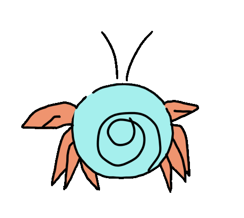
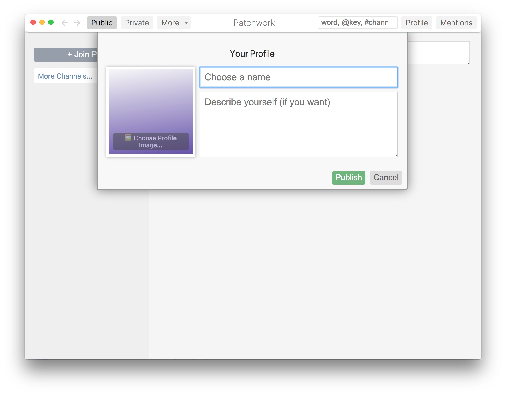
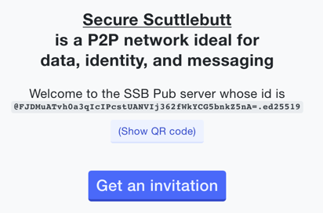
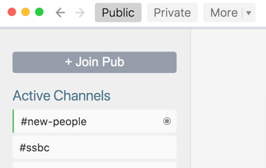
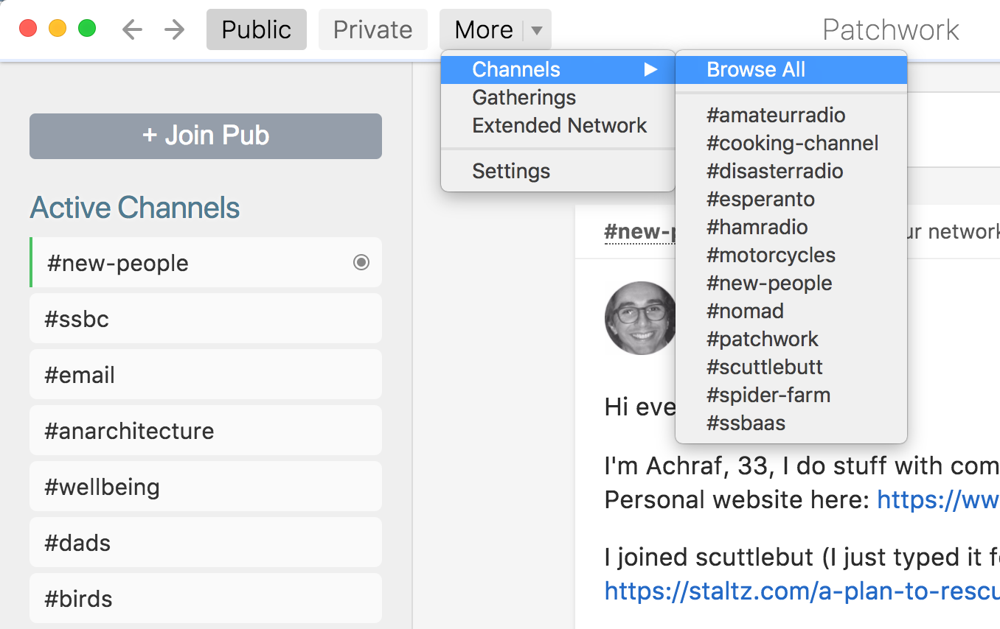

Ok, you've been hearing about [Scuttlebutt](https://scuttlebutt.nz)  and decided
that "Yes, I do want to join an amazing social network with lots of good people
that no company can control and also happens to also work offline. 

Here's a quick overview with the basics you need to know.

NOTE: If you have no time, and just need to get up and running ASAP, there's a
[Quick Start](README.md#quick-start) in the introduction. 

First off Scuttlebutt is a protocol on which many different kinds of apps can be
built. 

As for the social network, there are many clients, just like there are many
Twitter clients. It doesn't really matter which one you use. They're all talking
on the same network. 

Patchwork is the most polished client and it doesn't require you to know any
geeky stuff. The only caveat is that it just wants to run on one computer, and
your identity is tied to the files on the computer you install it on. There are
ways around this but it's beyond the scope of this document.

## Step 0: What is Scuttlebutt?

If you haven't done so already go to [the Scuttlebutt Home Page](README.md) 
and watch the video. Then come back. 

## Step 1: Install Patchwork, a Scuttlebutt app

[Download Patchwork](http://dinosaur.is/patchwork-downloader/), and
install it like any other app. 
 
## Step 2: Set up your profile

Start up Patchwork and set up your profile. 

Choose a name.  Names in Scuttlebutt are not unique, just like in the real world --
you can be "Fern" even if there are other people named "Fern" already.

You don't need to upload an image, but we recommend that you do, because it's
much easier to figure out who is talking when there's a visual, and the defaults
are really generic. Some people use a photo of themselves. Some people use a
random avatar they like, just like on Twitter.

You can change this all later (name, photo, and description).
**It's possible to discover your old names** and photo and description, so
consider the privacy implications of whatever you choose.  You may want to start
with a temporary-feeling identity and change it later once you settle in.

The description area like every text area in Patchwork uses
[markdown](http://commonmark.org/help/) formatting.

Save that when you're done.

## Step 3: Connections to people and pubs

Create social connections and network connections.

Scuttlebutt is unusual so it's worth understanding how this works:

Social connections (following someone) indicate that you're interested in reading their posts.
This is about the same concept as on Twitter.
Your computer uses your social connections to know what data it's interested in when it's syncing.

Network connections happen when two computers find each other and try to exchange data.
Your scuttlebutt app will try to connect with **any other Scuttlebutt computers it can find**
just in case they have data about people you're interested in.

So each person's computer acts like a courier or mail carrier, ferrying around messasges and giving
them to other nearby computers that are interested.  We call this process "gossip".

Scuttlebutt downloads everything it can up front, so that it will work when you're offline.  In that
way it's like an email client such as Outlook or Thunderbird.

### More about social connections and how posts travel

Your scuttlebutt app is interested in the people you follow, and the people **they** follow (2 hops out).
It won't show those more distant people to you in most screens of the app,
but it will try to download their posts in case you try to look at them.

If you're not following anyone, your computer won't request any posts and there will be nothing
for you to read.
And if nobody is following you, your posts won't get very far out into the network.

So your next task is to follow and become followed.

### Connecting to people locally

If you're sitting in the same room as someone, on the same wifi or wired network,
your computers will discover each other.  You'll see them listed in the left sidebar under "Local".

Click their profile to see more about them, and click "Follow" if you feel like
following what that person has to say and helping to ferry their data around.

Your computers will talk to each other even if you're not following each other, because
you might happen to have gossip about a mutual friend to sync.

### Pubs help you connect over a distance

"Pubs" are robot friends to get you started.
Think of them as bartenders in a neighborhood pub who know a lot of people, and help spread gossip.

They work the same as actual people on the network, except you can get them to follow you by "joining" them with an "invite code".

They exist for 2 reasons:
* To create more social connections, like that friend of yours who knows everybody in town, so gossip
can travel further and you can meet new people
* To create easier network connections, since they're always online and reachable from anywhere on the internet.

You don't have to use pubs if you and your friends carry your laptops around and sync up in person from
time to time.
But if you want to find new people, or distant people, you should join a couple of pubs.

### Time to join some pubs

"Joining" a pub causes you and the pub to become mutual followers.

Choose a pub from [the list of pub servers](https://github.com/ssbc/ssb-server/wiki/Pub-Servers).

Open one up and you'll see something like this.

Click the button to "Get An Invitation" and it'll generate a custom invitation
code just for you. Copy the whole thing. Then click the "+ Join Pub" button in
Patchwork at the top left.

It's good to join a few pubs for better reliability, in case one of them breaks.

If you've already got a friend on Scuttlebutt, try to join at least one of the
same pubs as them so that you can see each other.  (Ask them which pubs they're on.)

## Step 4: Getting all the Gossip

**The first time you join the network there will be a
lot to download and process - expect this to take up to an hour and use a
couple of gigabytes.**  It's a good time to go have a cup of tea.

Patchwork is downloading the entire history of the all people you're interested in.
Once this is done you can use it offline!

It goes faster if you have a friend's computer on your wifi because you can get
most of the content from their computer instead of from across the internet.

There's a progress bar at the top of the window.  During this time it's best
to leave the app alone and not try to use it because it can seem slow or broken.
It's safe to quit and restart the app while this is happening.

Patchwork has a bug - after the first long syncing process is done you need to
restart the app in order to see most of the content.

### What are all these pubs listed in the Patchwork sidebar?  I didn't join those!

In the left sidebar is a list of "connected pubs".  These are network connections,
not social connections.

You computer is talking to every computer it can find in case there's relevant gossip to share.
You haven't necessarily "joined" those pubs, your computer is just looking everywhere
for news from your friends.

The pubs you've "joined" show up on your profile page, mixed in with the people you're following.

## Step 5: Get Social!

The "Public" page shows you posts that your friends wrote or commented on.

The "Private" page lets you write private messages to up to 7 people at a time.

"Channels" are really more like hashtags on Twitter.  The Active Channels list shows recently
used channels, and you can find more in the More menu.  Channels are useful for organizing
topics of conversation, and for finding people to follow.

There's a search box in the top right.  Start with "@" to search for people, "#" to find
channels, or just put words you want to find.

We have a tradition that new people write introductions in the #new-people channel.
The easiest way to get there is to search for "#new-people"

### Writing

You can write new posts at the top of the Public page or any Channel page,
or comment on someone else's post.

Posts are written with [Markdown formatting](https://commonmark.org/help/).
You can mention people using "@" and they will get a notification on their Mentions page.

When you're done, click "Preview & Publish".  This lets you check that your
formatting looks good, then you can actually publish it.

**NOTE!** Posts are permanent!  You can't edit or delete them.  This isn't
an ideological thing, just a technical challenge that we're working on fixing.

So, use your spellcheck, actually look at the Preview, and don't publish in anger.
You won't be able to take it back. 

Scuttlebutt works offline just like email clients like Outlook and Thunderbird.
You can write posts and comments offline and they will sync later when you connect again.
Why not take your computer outside and write to your friends from under a tree?

Expect an email-like speed of communication - sometimes people respond quickly,
and sometimes it's more like having a penpal and waiting for the mail to arrive.

### Some places to start

Once onboard patchwork, check out the following channels by typing their name
(with #) in the search bar:

* #new-people: introduce yourself
* #faq: first impressions, what is confusing as a new user?
* #patchwork: report bugs, suggestions, etc
* #scuttlebutt: technical discussion

Introducing yourself in the #new-people channel is a great way to encounter others you 
might like to follow and who might like to follow you. Unless you do so, even though 
other people are able to see your posts, it is possible that nobody will notice your 
arrival especially if things are busy at the time and this might lead to a lonely and 
discouraging experience. We're a friendly bunch so please don't be shy! Come and 
tell us a bit about yourself in #new-people so we can help you find other people 
that you might be interested in getting to know better.

## Linking To Things 

### Profiles and Channels

The simplest form of linking is a reference to a person or a channel. Just start
typing `@` and the person's name and Patchwork will help you out with suggestions
as you type. Hit enter when you have the right one. The same applies to
channels. Just start typing a `#` and the channel's name instead. 

You can use multiple channel names in the text of your message, just like hashtags on Twitter.

### Everything else

Linking to an external web page with Markdown is easy, just say
`[display text](https://whatever.com)`.

How do you link to other messages _in_ Scuttlebutt though? Well, first you need
the message id. Right click on a link to the message you want to link to and
choose "Copy Message ID" Then make a link just like a normal url link but use
the message id as the destination. 

Profiles are a little different and normally you just let Patchwork autocomplete
for you when you type `@`.  To do it manually, you can find their "feed id" on their
profile page just under their name.  It's a long random series of characters starting
with an `@`.

### Sharing Scuttlebutt things with other people 

We had a system to put Scuttlebutt content on the normal internet but it's being phased out now.
If you want to try it, right-click a post and "Copy External Link".

The public viewer is kept running by the generosity of 
[a community member](https://github.com/clehner) not some mega-corp. with racks 
of backup servers. ;) 

Only people who have opted-in to the public viewer will show up there.
Check out the [Privacy page](/faq/misc/privacy.md) for details. 

## Stay Happy and Safe

If someone is bothering you or saying things you don't want to hear, you can block or ignore them
from their profile page (in the Options button).  This will hide their messages and comments from you.

You can loudly **block** someone, or quietly **ignore** them.

A block is public and everyone can see it.
Blocking is a way to demonstrate community norms and alert your friends to someone they may also want to block.
Sometimes it starts useful conversations.

Ignoring quietly is a secret action that only you will know about.  It hides the person from your view.

We want Scuttlebutt to be a safe cozy place but there are still some things we need to fix:
* Blocked people can see your public messages.
* Content from blocked people is still on your computer.  (This is almost fixed!)
* Patchwork has some bugs that let you see blocked people in certain situations when they should be hidden
* Scuttlebutt doesn't provide IP address anonymity by itself, but you can use it with a VPN or Tor.
* Messages can't be deleted yet.

We know this isn't enough safety for many people and we're working on these issues now.
