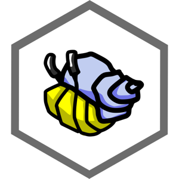

Ok, you've been hearing about [Scuttlebutt](https://scuttlebutt.nz)  and decided
that "Yes, I do want to join an amazing social network with lots of good people
that no company can control and also happens to also work offline. 

Here's a quick overview with the basics you need to know.

NOTE: If you have no time, and just need to get up and running ASAP, there's a
[Quick Start](README.md#quick-start) in the introduction. 

First off Scuttlebutt is a protocol on which many different kinds of apps can be
built. 

As for the social network, there are many clients, just like there are many
Twitter clients. It doesn't really matter which one you use. They're all talking
on the same network. 

Patchwork is the most polished client and it doesn't require you to know any
geeky stuff. The only caveat is that it just wants to run on one computer, and
your identity is tied to the files on the computer you install it on. There are
ways around this but it's beyond the scope of this document.

## Step 0 

If you haven't done so already go to [the Scuttlebutt Home Page](README.md) 
and watch the video. Then come back. 

## Step 1 

[Download Patchwork](http://dinosaur.is/patchwork-downloader/), and
install it like any other app. 
 
## Step 2 

Boot it up and set up your profile. 

It doesn't matter what name you put. It can be your real name. It can be a
nickname. Like the real world it's entirely possible for multiple people to have
the same name. Your friends can give you nicknames too. 

You don't need to upload an image, but we recommend that you do, because it's
much easier to figure out who is talking when there's a visual, and the defaults
are really generic. Some people use a photo of themselves. Some people use a
random avatar they like, just like on Twitter.

The text area, like every text area in Patchwork uses
[markdown](http://commonmark.org/help/) formatting.

Save that when you're done.

## Step 3 

Get connected. 

Because Scuttlebutt is a distributed network you need to find
some people to follow. This is partially because it's really _really_ boring if
you're not listening to anyone and no-one is listening to you. It's also because
you get "gossip" from the people you follow. "Gossip" is more than just info
about people you're interested in. It is also the name of [a protocol](concepts/gossip.md) 
that Scuttlebutt uses to share information. 

The more people you follow, the more your network opens up.

Every additional person, and pub you follow is another channel for gossip to use
to flow through to you. If you don't follow _anyone_ (not even pubs) you won't
receive _any_ new posts because there won't be anyone gossiping with you.
Channels may look bare because the only people talking in them are too distant
(in terms of friend relationships) for you to hear. 

### Connecting Locally 

Most of us don't happen to be sitting next to someone
else on the same network.  If you _are_ you'll see them listed under "local" on
the left, otherwise this will be hidden. Click their profile to see more about
them, and click "Follow" if you feel like following what that person has to say
(just like Twitter).  You'll start downloading information from them that
they've posted to the network _and_ information their friends have posted. 

### Remotely 

Even if you _are_ next to someone you'll still want to connect to a
"pub" server so that you can exchange info with others if no-one is nearby. In
the video they're described as being more like bartenders than pubs, because
it's the bartender who you gossip with at the pub, and shares the gossip of
others.

Go to [the list of pub servers](https://github.com/ssbc/scuttlebot/wiki/Pub-Servers). 

Open one up in a new tab and you'll see something like this.

Click the button to "Get An Invitation" and it'll generate a custom invitation
code just for you. Copy the whole thing. Then click the "+ Join Pub" button in
Patchwork. 

There's a limit to how far gossip will travel through a network of people, and
the bartender at a pub is just another "person" in the chain. Because of this
it's good to connect to a few pubs. Also, it spreads the load. 

**Note:** If you've already got a friend on Scuttlebutt, ask them what pub(s)
they follow. Otherwise it's possible that you'll be out of range of each other,
so to speak. 

The pubs you're currently connected to are listed on the left side if you click
on "Public".

## Getting all the Gossip

As soon as you connect to a pub or start following a person Scuttlebutt will
start syncing down all the "gossip" they have for you, and pass on any "gossip"
you have for them. *The first time you connect to a pub server there will be a
lot to download.* So, give it some time.

(Please note that if you unfollow the pub before following other people you will not 
be able to see anything and the network will appear empty. Since the pub still follows 
you, others will see you but you will not be able to hear what they say.)

The pub is a robot friend to get you started. When you are invited to join a pub 
it follows you back. That way you can see friends of that pub. Robots are great but 
following people is even nicer. 

## Get Social!

You'll see some channels listed in "Active channels" on the left, but the "More"
menu up at the top has a "Browse All" option under "Channels".

 
Find a topic that looks interesting and start reading. Hint: perhaps the most important 
channel when you start is #new-people. When you're ready to "Publish" remember that 
it uses Markdown formatting. 

Remember, it doesn't matter if you're online or not. You'll still see all the
images, and you'll be able to respond to posts and create new ones. The next
time you connect to a local person or a pub server everything will connect up.
When you're online this will happen constantly, and responses can appear very
quickly. 

### Some places to start

Once onboard patchwork, check out the following channels by typing their name
(with #) in the search bar:

* #new-people: introduce yourself
* #faq: first impressions, what is confusing as a new user?
* #patchwork: report bugs, suggestions, etc
* #scuttlebutt: protocol related discussion

Introducing yourself in the #new-people channel is a great way to encounter others you 
might like to follow and who might like to follow you. Unless you do so, even though 
other people are able to see your posts, it is possible that nobody will notice your 
arrival especially if things are busy at the time and this might lead to a lonely and 
discouraging experience. We're a friendly bunch so please don't be shy! Come and 
tell us a bit about yourself in #new-people are we can help you find other people 
that you might be interested in getting to know better.

**NOTE:** There is no edit. There is no Undo. There is no delete. So, use your
spellcheck, actually look at the Preview, and don't publish in anger. You won't be
able to take it back. 

## Linking To Things 

### Profiles and Channels

The simplest form of linking is a reference to a person or a channel. Just start
typing `@` and the person's name and Patchwork will help you out with suggestions
as you type. Hit enter when you have the right one. The same applies to
channels. Just start typing a `#` and the channel's name instead. 

### Everything else

Linking to an external web page with Markdown is easy just say 
`[display text](destination url)` 

How do you link to other messages _in_ Scuttlebutt though? Well, first you need
the message id. Right click on a link to the message you want to link to and
choose "Copy Message ID" Then make a link just like a normal url link but use
the message id as the destination url. 

Profiles are a little different. A profile is a feed for a single person. So, in
that case you want to use "Copy Link Ref" For example, if I wanted to link to
André's profile I'd say 
`[here's André's profile](@QlCTpvY7p9ty2yOFrv1WU1AE88aoQc4Y7wYal7PFc+w=.ed25519)` OR you can do
it the easy way. Just type `@andre` and hitting enter when the autocomplete has
chosen the right one. Then edit the display text to be whatever you want. 

### Sharing Scuttlebutt things with other people 

If you want to share a really interesting conversation with a friend who
isn't on Scuttlebutt yet, just right click on the first message in the
thread, chose "Copy External Link" and then message them that link. You could
Tweet it or post it on Facebook, or whatever.  The link goes to a public site
where you can see, but not interact with, posts on Scuttlebutt. Note: the public
viewer is kept running by the generosity of 
[a community member](https://github.com/clehner) not some mega-corp. with racks 
of backup servers. ;) 

It should be noted that people can indicate that they don't want their stuff
shown on public sites or in search results on sites like Google. Check out the
[Privacy page](/faq/misc/privacy.md) for details. 

## Stay Happy and Safe

Don't worry, if come across someone whose views make you uncomfortable. You can
always block them, and you'll never receive any of their posts again, and they
won't get yours either. 

