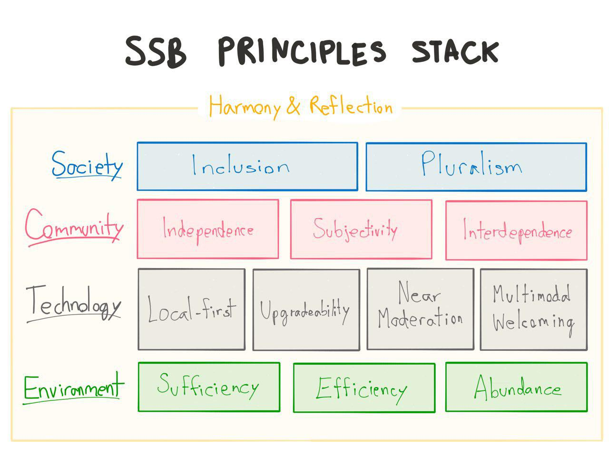

# Principles

Scuttlebutt aims to harmonize four perspectives of life: **Environment** reflecting **Technology** reflecting **Community** reflecting **Society**.

We acknowledge the natural, the virtual, and the social environments. Our responsibility is to recognize which resources are **abundant**, which are **sufficient**, and adapt accordingly through **efficiency**.

Technology is simply the means by which we communicate. We use **local-first** publishing so that each person owns their words and actions. Our solutions are piecemeal **upgradeable**, replaceable and incrementally improvable. Tending and pruning are not a stranger's duty, it is through **near moderation** and free listening that we improve our surroundings. Infrastructure is a voluntary act, **multimodal welcoming** is how we on-board people via diverse connectivity modes (technological acts of inclusion) as well as with greetings (words of inclusion). No one "signs up" but everyone is invited.

Our community is a web of friendships: relationships defined not by a follow button, but by the flexibility of **subjectivity**. We cherish the freedom to be **independent**, but it is this same freedom which encourages – not coerces – us to be **interdependent**. We know we can at any time fork, but when individually recognizing the whole being greater than the sum of its parts, we tend to develop the collective. We value disagreement when it's supportive, and see it as generative and bond forming.

Society is not made of homogeneous people, so we must allow **pluralism** of cultures to flourish. The edges of the social graph must extend to **include** all people and their diverse values, interactions, and customs. No one of us can build a welcoming place for all groups, because the very concept of welcoming is subjective. Instead, removing ourselves as arbiters of other communties, we must design platforms that are easy to re-design.
