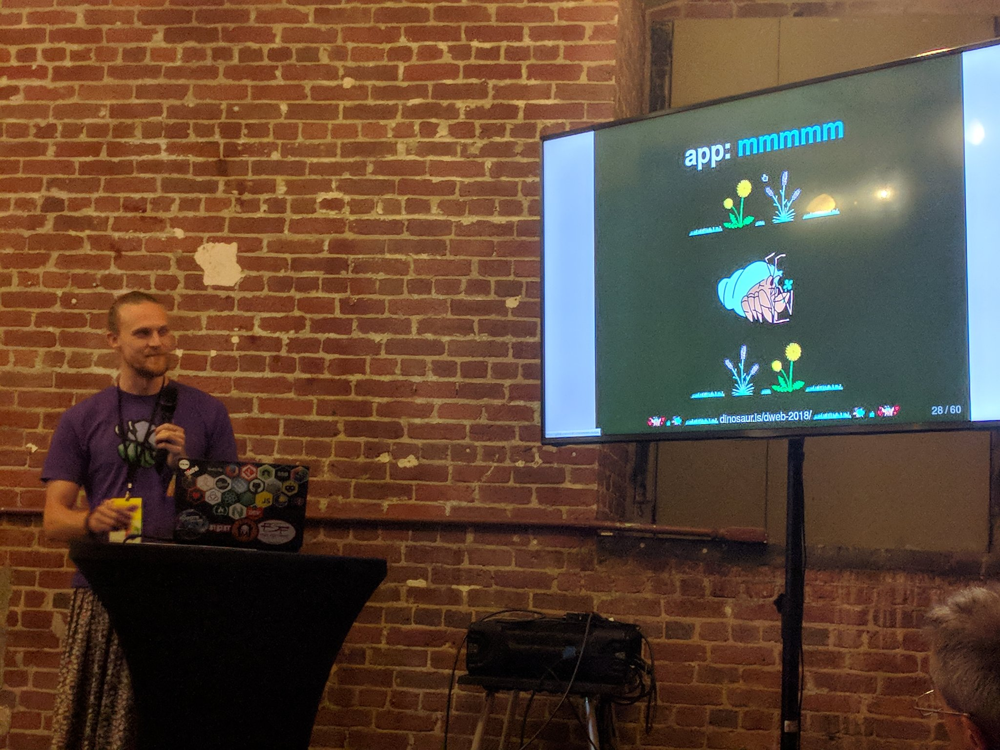
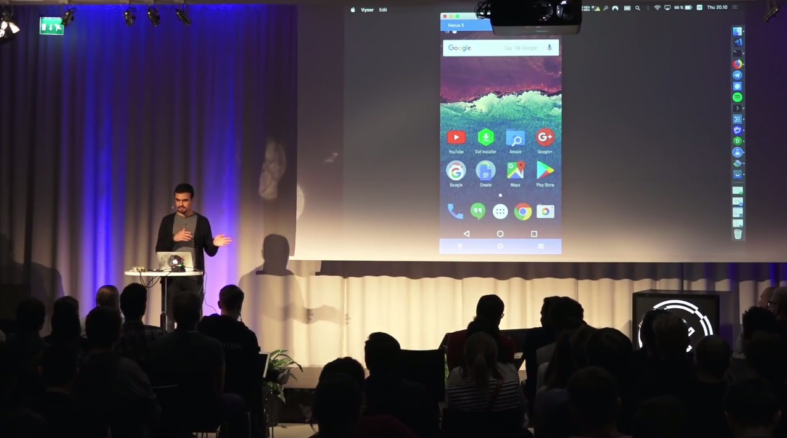
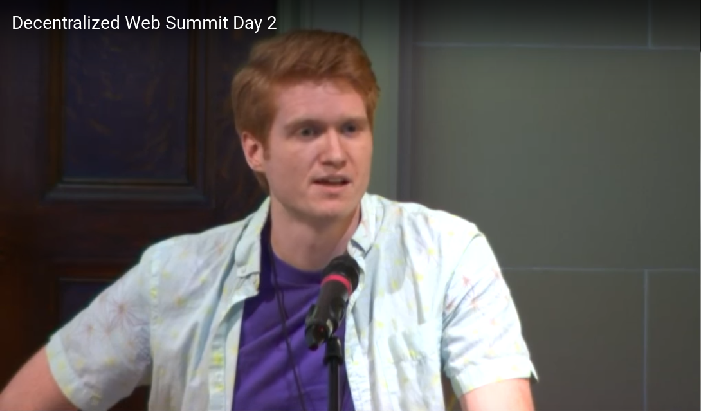
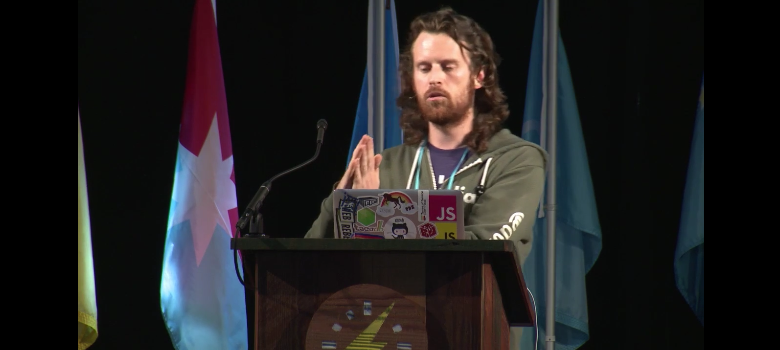
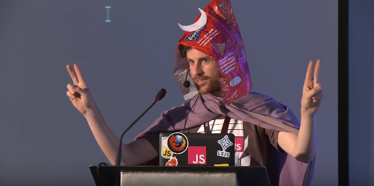

# Scuttlebutt Talks

## Reinvent the Social Web

### André Staltz @ FullStackFest 2018

_TODO_ once video is published

https://twitter.com/andrestaltz/status/1036553690176540672

## a tour of the Scuttlebutt Ecosystem

### Mikey (dinosaur) @ DWebSummit 2018

https://vimeo.com/ahdinosaur/dweb-2018

## What is the meaning of "decentralization"?

### Dominic Tarr @ DWebSummit 2018

> Taken literally, "decentralization" just means "not centralized", but what are the different ways something can be not centralized? Are there different types or flavors of decentralization that can be meaningfully distinguished?

https://decentralizedweb.net/videos/tech-talk-what-is-the-meaning-of-decentralization/

## It's time to build our own Internet

### André Staltz @ TEDxGeneva

> The world is beginning to learn about problems of the smartphone era that affect everything from our minds to our politics. But the smartphones are not to be blamed. The infrastructure of the Internet, often hidden from our sight, provided the technological foundational for the problems we are seeing today. It is possible to build an alternative Internet made with modern wireless technologies and new software, that make a new foundation for freedom in the digital era. André is developing software for the new Internet, and blogs about the current macroscopic changes in Cyberspace. He wrote viral blog posts such as "The Web began dying in 2014", "A plan to rescue the Web from the Internet", and "Layers of the Internet Economy". He works as an open source programmer funded by donations, and is developing a free and decentralized social network for phones, together with other pioneers. André also teaches programming through workshops and conference talks, having had spoken at dozens of conferences around Europe. 

https://youtu.be/UjfWAbGfPh0

## O fim da Internet

### André Staltz @ BrazilJS Conf 2017

> Nenhuma tecnologia desaparece da noite pro dia. Assim como o telefone fixo e o Flash, tecnologias sofrem uma gradual redução de uso que pode durar anos ou décadas até desaparecerem completamente. Os primeiros sinais do fim da internet original, aberta e decentralizada, já estão surgindo. Nesta palestra você vai descobrir quais são esses sinais, o que vai acontecer nos próximos anos, e como uma alternativa à internet está sendo criada, usando apenas JavaScript.

https://youtu.be/CcDMWrH6VHU

## The Decentralized Web

### André Staltz @ Hack\Talks in Helsinki, 2017

> André will cover of topics such as peer-to-peer browser, off-grid social network, and local development, and their underlying technologies Dat and SSB, both implemented in JavaScript / Node.js.

https://youtu.be/qZDJ1z0apVk?t=7787

## Embracing Subjectivity

### Mix Irving @ nz.js(con); New Zealand JS Conference 2017

> Cast central authorities aside and take a tour of a inter-net conceived subjectively. Learn about the challenges and benefits of not having singlular sources of truth, and take a tour of the Scuttleverse - an actively growing decent community (of code and humans).

https://youtube.com/watch?v=P5K18XssVBg

## Signed Merkel Logs

### Paul Frazee @ Decentralized Web Summit

> Signed merkle logs: What are they, and Why they're so useful in decentralized systems.

https://www.youtube.com/watch?v=PfWgin3JlAU&t=20417

## SecureScuttlebutt: A Secure Gossip Protocol

### Dominic Tarr @ New Zealand Internet Research Forum

%6Yjqj01y7Z5Nmc5HItGojEtz8rUGMcfRLiPQQgZpBF0=.sha256

https://github.com/dominictarr/ssb-talk/blob/master/slides.md

## Design Challenges of Decentralized Systems

### Dominic Tarr @ Data Terra Nemo 2015

https://www.youtube.com/watch?v=_3eBT46vkaI

## Decentralized Databases, and the End of the Web Host

### Paul Frazee @ JS.LA April 2015

> How do we synchronize user devices without using servers or central coordination? Join us for a discussion of content-addressing, secure data structures, the web of trust, and apps-development in a post-host Web.

https://www.youtube.com/watch?v=8sXTEi8U2bw

## Secure Database Games

### Dominic Tarr @ nodeconf.eu 2014

https://www.youtube.com/watch?v=Z8tfpRr1Hu8

## Mad Science Architectures

### Dominic Tarr @ Realtime Conference 2013

The puzzle pieces of secure-scuttlebutt are being assembled.

https://vimeo.com/77352417

## Colouring with crayons and playing with Duplo blocks

### Dominic Tarr @ node Dublin 2012

On replication, eventual consistency, scuttlebutt and crayons.

https://www.youtube.com/watch?v=giS-aIq0Kaw
