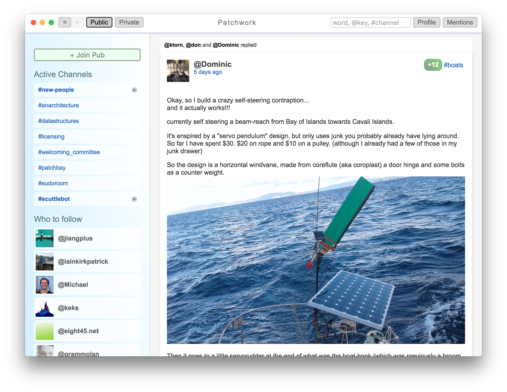

# ssb گٹکا 

SSB-آیت اور کلیدی تصورات اور اثرات کے لیے کام میں پیش رفت کی گائیڈ

## Scuttlebutt کیا ہے؟


تاریخی طور پر، گپ شپ کے لئے سمندر بول چال - ایک scuttlebutt بنیادی طور پر ایک جہاز پر ایک watercooler ہے.

Scuttlebutt ایک مہذب (ralised) محفوظ گپ شپ پلیٹ فارم ہے.

> یہ اس حقیقی سائنس ہے ایک پاگل کے نام کی طرح لگتا ہے، لیکن میں آپ کو یقین دلاتا. یہ پڑھو: http://www.cs.cornell.edu/home/rvr/papers/flowgossip.pdf
>
> یا، اگر آپ سست ہو تو: http://en.wikipedia.org/wiki/Scuttlebutt (کاہلی کہیں آپ کو ملے گا)

## کس طرح شروع کرنے کے لئے

شروع کرنے کے لئے سب سے آسان طریقہ [دوزی] استعمال کر رہا ہے (https://github.com/ssbc/patchwork)، ایک کلاسک سوشل نیٹ ورکنگ [ایپلیکیشن] (./ applications.md).



## patchwork کے انسٹال کریں

ونڈوز، MacOS اور لینکس کے لئے ### ڈاؤن لوڈ انسٹالرز

ملاحظہ کریں [دوزی / ریلیز] (https://github.com/ssbc/patchwork/releases)


### یا ذریعہ سے تعمیر

ساتھ [node (>= 4) npm (>= 2) نصب](https://github.com/creationix/nvm):

```shell
$ git clone https://github.com/ssbc/patchwork
$ cd patchwork
$ npm install
$ npm start
```

لینکس پر آپ کو کچھ زیادہ انحصار کرنا ہوگا. Debian کا پر:

```shell
sudo apt-get install libxext-dev libxtst-dev libxkbfile-dev g++ m4 automake libtool
```

ایک پب میں مدعو کرنا ###

آپ کے مقامی نیٹ ورک کے باہر گپ شپ کرنے کے لئے، آپ کو ایک [شراب خانہ] سے رابطہ قائم کرنے کی ضرورت ہو گی (./ تصورات / pub.md).

آپ کو تلاش میں ایک [شراب خانہ سرورز رجسٹری] پر ایک دستیاب پب کے لئے مدعو کر سکتے ہیں (https://github.com/ssbc/scuttlebot/wiki/Pub-Servers).

، دعوت حاصل پھر `patchwork` میں: پر کلک کریں" + شراب خانہ شمولیت "اور دعوت دیتے کوڈ پیسٹ کریں.

اس سے آپ کو پب پیروی اور vise برعکس کرنے کا سبب بن جائے گا. اگر آپ نے ابھی اس سماجی نیٹ ورک پر مطابقت پذیر نہیں ہوا ہے تو، آپ کے مقامی سرور مطابقت پذیر ہیں جبکہ چند منٹ انتظار کرنے کی تیاری.

## کمیونٹی میں شامل ہوں

- **#new-people**: اپنا تعارف کراوء
- **#faq**: پہلی نقوش، کیا ایک نئے صارف کے طور پر بردوست ہے؟
- **#patchwork**: رپورٹ کے کیڑے، تجاویز، وغیرہ
- **#scuttlebutt**: پروٹوکول متعلق بحث
- **#कॉशुर**: کشمیر وادی

یہ ہینڈ بک کے بارے میں ##

پبلک گٹکا دیکھنے کے لئے، کو براؤز کریں [scuttlebutt.nz/ur](https://www.scuttlebutt.nz/ur)

گٹکا موضوعات کی طرف سے منظم کیا جاتا ہے:

* [شراکت] (contributing.md)
* [مذاکرات] (talks.md)
* [درخواستیں] (applications.md)
* [اصول] (principles.md)
* [کہانیاں](stories/index.md)
* [ماڈیولز] (modules.md)
* [تصورات](concepts/index.md)
* [فرھنگ] (glossary.md)


## Other documentation

Over time we have scattered documentation around in a few places:

- [scuttlebot.io](https://scuttlebot.io)
- [ssbc.github.io](https://ssbc.github.io)

[Please help us consolidate this here](contributing.md#contributing-documentation)!

## Other Projects

Scuttlebutt is not the only dex project:

- [Matrix](http://matrix.org/)
- [Bitcoin](https://bitcoin.org/)
- [Ethereum](https://www.ethereum.org/)
- [Zerocoin](http://zerocoin.org/)
- [MaidSafe](http://maidsafe.net/)
- [IPFS](https://ipfs.io/)
- [Dat](http://datproject.org/)
- [Solid](https://github.com/solid/solid)
- [cjdns](https://github.com/cjdelisle/cjdns)
- [Syncthing](https://syncthing.net/)
- [Indie](https://ind.ie/)
- [Twister](http://twister.net.co/)
- [WebTorrent](https://webtorrent.io/)
- [StrongLink](https://github.com/btrask/stronglink)
- [RetroShare](http://retroshare.sourceforge.net)
- [ZeroNet](http://zeronet.io)
